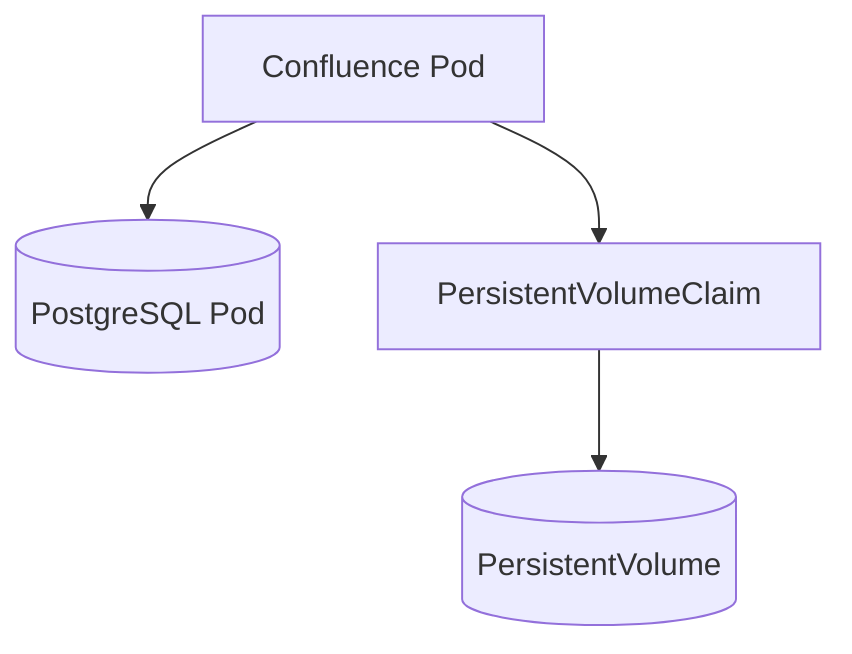
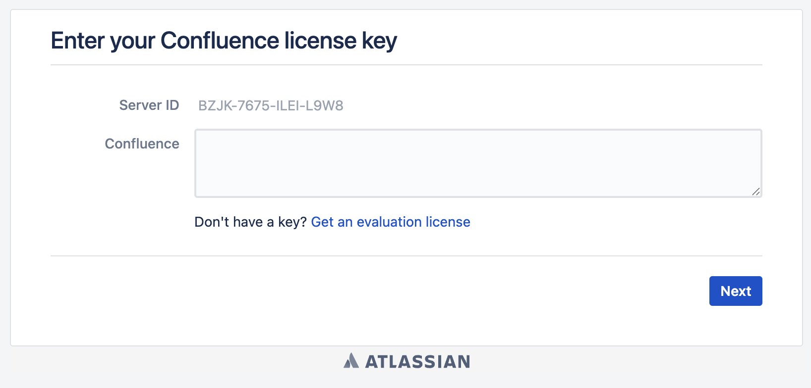
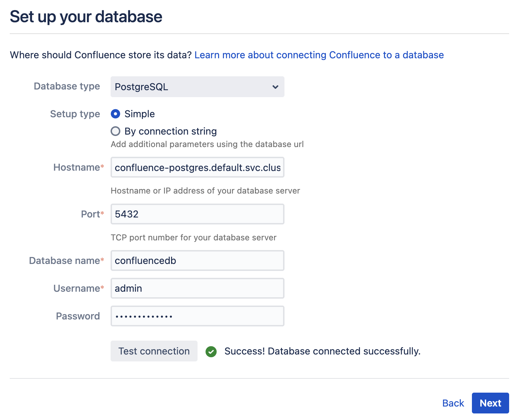

### Installation Instructions
The below steps will walk you through how to use this helmchart to install a local confluence instance!



Steps to run:
1. 
```
helm install confluence .
```
2. When your confluence pod is ready, port forward it.
3. With the port forward running, access your confluence web GUI by looking at [http://localhost:8090⁠](http://localhost:8090/).
4. When viewing localhost, you will see this page:

so:
5. Get a trial Confluence license by following the link in the page. Here is also a [Guide From Confluence on the topic](https://support.atlassian.com/confluence/kb/how-to-generate-an-evaluation-or-trial-license-for-confluence-data-center/).
6. Enter your license key into the web GUI
7. Choose 'non-clustered'
8. For the postgres connection, use the following values:

| Variable Name | Value|
| --- | --- |
| Hostname | confluence-postgres.default.svc.cluster.local |
| Port | 5432 |
| Database name | default is `confluencedb`, but you can update it in values.yaml postgres.auth.database |
| Username | default is `admin`, but you can update it in values.yaml postgres.auth.username |
| Password | default is `localpassword`, but you can update it in values.yaml postgres.auth.password |

Then test the connectivity by clicking the 'test connection' button!



<details>
<summay>On the Hostname</summary>
Note that the hostname contains the release name from your helm install command (`<release-name>-postgres.<namespace>.svc.cluster.local`), so if you are using a different release name or namespace, the hostname will change accordingly. 

For example, if you installed this helmchart using the command `helm install example .`, the hostname would instead be called `example-postgres.default.svc.cluster.local`.
</details>

9. From here, feel free to follow the Confluence prompts to set up your local instance! 🎉

You may uninstall everything with
```
helm uninstall confluence
```

This will retain the persistent volume claim however, such that your confluence's pages will not be lost. If you want the claim to be removed too, update the `confluence.persistence.volumeRetainPolicy` in values.yaml to `Delete`.

If you are making helm chart changes, test them first with
```
helm template . -f values.yaml
```

### How to renew your Confluence license

1. You may find your confluence's Server ID by navigating to [http://localhost:8090/admin/license.action](http://localhost:8090/admin/license.action). You will need to log in using the admin credentials you configured when you first set your Confluence instance up.
2. You may request a new trial license by navigating [here](https://www.atlassian.com/purchase/my/license-evaluation), and selecting Confluence > Data Centre. Fill out the required fields, along with your Server ID, to request your new trial license.
3. Paste your license into the [license.action](http://localhost:8090/admin/license.action) page you have open for your local Confluence instance, click save, and you are done!

### DevNotes
Things to do:
- work out _helpers.tpl